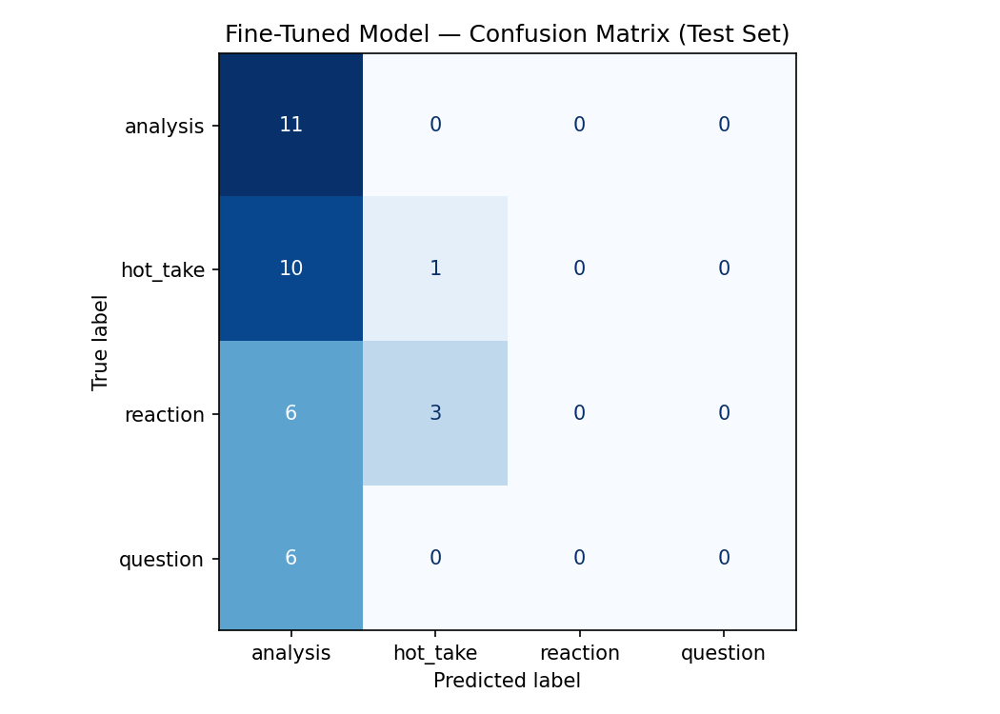

# TakeMeter: NBA Discussion Take Classification

## Overview

TakeMeter is a text classification project that categorizes NBA Reddit comments into four discussion types:

* Analysis
* Hot Take
* Reaction
* Question

The goal is to determine whether a comment is providing basketball reasoning, expressing a strong opinion, reacting emotionally, or asking a question.

Data was collected from NBA discussion communities including r/nba and r/NBATalk.

---

## Community Choice

I selected NBA discussion communities because they contain a wide variety of discussion styles. Within the same thread, users may provide detailed statistical analysis, make bold predictions, react emotionally to news, or ask questions.

This makes NBA Reddit a good environment for studying subjective text classification because the boundaries between categories are not always clear.

---

## Label Taxonomy

### Analysis

A comment that explains an idea using reasoning, evidence, statistics, comparisons, strategy, or context.

Examples:

* "Towns at 8 when he averaged 15/10 in the playoffs and had a subpar finals is ridiculous."
* "The Knicks have better wing defenders than the Spurs which could create matchup problems."

### Hot Take

A strong opinion, ranking, prediction, or claim with little supporting evidence.

Examples:

* "Jokic, SGA, Wemby, Luka, and Giannis are the top five. Any other list is wrong."
* "The Spurs just lost the series with this choke."

### Reaction

An emotional response, joke, meme, expression of surprise, praise, frustration, or agreement.

Examples:

* "No f---ing way dude holy s--t."
* "Well we now have a new meme."

### Question

A comment primarily intended to request information, clarification, opinions, or discussion.

Examples:

* "Who is the face of basketball right now?"
* "What are the greatest NBA games of all time?"

---

## Dataset

### Data Source

Comments were manually collected from public Reddit discussions in:

* r/nba
* r/NBATalk

### Labeling Process

Each comment was reviewed manually and assigned one label based on its primary purpose.

When comments contained characteristics of multiple labels, the label representing the main intent of the comment was selected.

### Difficult Examples

**Example 1**

"I love OG, but the hell is he doing at 11th spot?"

Although written as a question, this was labeled Question because the primary structure is asking about a ranking.

**Example 2**

"Whichever one gets me paid more."

This was labeled Hot Take because it expresses a personal preference rather than analysis.

**Example 3**

"Well we now have a new meme."

This was labeled Reaction because it is an emotional observation rather than a basketball argument.

### Label Distribution

| Label    | Count |
| -------- | ----: |
| Analysis |    72 |
| Hot Take |    72 |
| Reaction |    60 |
| Question |    39 |
| Total    |   243 |

No label accounts for more than 70% of the dataset.

---

## Fine-Tuning Pipeline

### Base Model

* Model: DistilBERT (`distilbert-base-uncased`)
* Platform: Google Colab using a T4 GPU

### Training Decisions

Key hyperparameters:

* Epochs: 3
* Learning Rate: 2e-5
* Batch Size: 16

Three epochs were selected because the dataset is relatively small. Increasing the number of epochs would increase the risk of overfitting.

A learning rate of 2e-5 was chosen because it is a common starting point for fine-tuning BERT-family models and provides stable training.

The batch size of 16 fit comfortably within the memory limits of the T4 GPU while allowing efficient training.

---

## Baseline Classifier

The baseline model used Groq's `llama-3.3-70b-versatile` model in a zero-shot classification setting.

The following prompt structure was used:

* Define all four labels
* Provide one example for each label
* Ask the model to classify a comment
* Require the model to output only a label name

Predictions were collected on the same held-out test set used for the fine-tuned model to ensure a fair comparison.

---

## Evaluation Results

### Accuracy Comparison

| Model                                   | Accuracy |
| --------------------------------------- | -------: |
| Groq Llama 3.3 70B (Zero-Shot Baseline) |    51.4% |
| Fine-Tuned DistilBERT                   |    32.4% |

### Fine-Tuned Model Metrics

| Label    | Precision | Recall |   F1 |
| -------- | --------: | -----: | ---: |
| Analysis |      0.33 |   1.00 | 0.50 |
| Hot Take |      0.25 |   0.09 | 0.13 |
| Reaction |      0.00 |   0.00 | 0.00 |
| Question |      0.00 |   0.00 | 0.00 |

### Observations

The model performed best on the Analysis category and frequently predicted Analysis for examples belonging to other classes. The confusion matrix shows that Hot Take, Reaction, and Question comments were often misclassified as Analysis.

One likely explanation is that the label definitions overlap significantly. Many NBA discussion comments contain both opinions and reasoning, making it difficult to distinguish between Analysis, Hot Take, and Reaction. Additionally, the dataset contained only 243 examples, which limited the amount of training data available for each class.

Future improvements could include collecting more examples, refining the label definitions to reduce overlap, and balancing the dataset further across categories.

### Confusion Matrix

---

## Error Analysis

To better understand the model's performance, I reviewed several incorrect predictions from the test set.

### Example 1

**Text:** "Whichever one gets me paid more."

* **True Label:** Hot Take
* **Predicted Label:** Analysis

This comment was likely misclassified because it is very short and lacks strong opinion-related keywords. While a human reader can recognize it as expressing a personal preference, the model may have interpreted it as a general statement due to the lack of context.

### Example 2

**Text:** "I love OG, but the hell is he doing at 11th spot?"

* **True Label:** Question
* **Predicted Label:** Analysis

Although the comment is phrased as a question, it functions more as a rhetorical criticism of a player ranking. This highlights the overlap between the Question and Hot Take categories. The model appeared to focus on the basketball discussion content rather than the grammatical structure of the sentence.

### Example 3

**Text:** "Well we now have a new meme."

* **True Label:** Reaction
* **Predicted Label:** Analysis

This comment is primarily an emotional reaction and does not contain any reasoning or analysis. However, the model frequently predicted Analysis when it was uncertain. The confusion matrix shows that many Reaction examples were incorrectly classified as Analysis.

### Overall Error Pattern

The model achieved a test accuracy of 32.4%. While this is better than random guessing for a four-class problem (25%), the results show that the classifier struggled to distinguish between some categories.

Several factors likely contributed to the lower accuracy:

* Significant overlap between the Reaction, Hot Take, and Analysis labels.
* Many comments were extremely short and lacked enough context for reliable classification.
* Rhetorical questions often resembled opinions or reactions.
* The dataset contained only 243 examples, which limited the amount of training data available for each class.

The confusion matrix shows that the model heavily favored the Analysis label when uncertain. Future improvements could include collecting additional training examples, refining the label definitions to reduce overlap, or merging similar categories such as Reaction and Hot Take into a broader Opinion category.

---

## Results Comparison

The project compared a fine-tuned DistilBERT classifier against a zero-shot baseline using Groq's Llama 3.3 70B model.

| Model                                   | Accuracy |
| --------------------------------------- | -------: |
| Zero-shot Baseline (Groq Llama 3.3 70B) |    51.4% |
| Fine-tuned DistilBERT                   |    32.4% |

### Findings

The zero-shot baseline outperformed the fine-tuned model by 18.9 percentage points.

This result was somewhat unexpected, but several factors likely contributed:

* The dataset contained only 243 labeled examples.
* The labels were highly subjective and often overlapped.
* Categories such as Analysis, Hot Take, and Reaction frequently contained similar language patterns.
* DistilBERT had limited training data from which to learn clear boundaries between classes.

The confusion matrix showed that the fine-tuned model frequently predicted the Analysis category when uncertain, while the Groq baseline was able to better distinguish among all four labels using the label definitions and examples provided in the prompt.

### Conclusion

For this dataset and classification task, prompt-based classification with a large language model performed substantially better than fine-tuning a smaller transformer model. This demonstrates that modern instruction-tuned models can be highly effective on small, subjective classification tasks where labeled training data is limited.

---

## AI Usage

Example 1: Dataset Development

I used Claude to help identify NBA Reddit threads that contained a variety of discussion styles, including analysis, reactions, questions, and hot takes. AI also helped generate candidate examples from those threads. However, every example was manually reviewed and assigned a label by me. In several cases I disagreed with the suggested label and changed it based on the taxonomy definitions.

Example 2: Error Analysis

After training the classifier, I used Claude to help review misclassified examples and identify common failure patterns. The AI suggested possible explanations for why the model confused certain categories, but I reviewed the predictions myself and selected the final explanations included in the report.

---

## Spec Reflection

The project specification was helpful because it required defining labels before collecting data. Creating the taxonomy first made the annotation process more consistent and reduced ambiguity when labeling comments.

One way the implementation diverged from my expectations was model performance. I originally expected the fine-tuned DistilBERT model to outperform the baseline. Instead, the zero-shot Groq model achieved 51.4% accuracy while the fine-tuned model achieved 32.4%.

This result showed that subjective classification tasks with small datasets can be challenging for traditional fine-tuning. The large language model was able to use the label definitions and examples in the prompt to reason about the categories, while the fine-tuned model struggled to learn clear decision boundaries from only 243 examples.

If I were continuing the project, I would focus on collecting more examples and refining the distinctions between Analysis, Hot Take, and Reaction before retraining the model.
